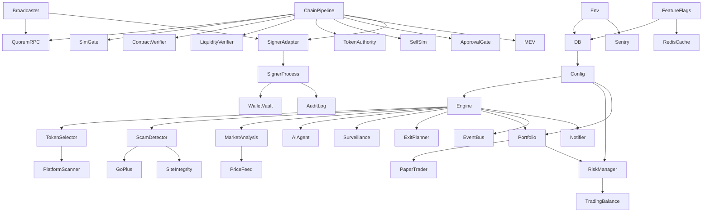

# Arquitetura Modular — Catálogo de Apps + Feature Flags

> **Versão:** 1.0 — 2026-08-26
> **Padrão:** Monolito modular (não microsserviços) — escala 100→50k sem overhead de rede.
> **Princípio:** Cada módulo tem `types.ts` + `service.ts` + `routes.ts` + `tests` isolados; depende de interfaces, não de implementações.

---

## 1. Mapa de Módulos (Catálogo)

```
src/
├── app/                          # Next.js App Router (UI + API)
│   ├── page.tsx                  # Dashboard (orquestra todos os panels)
│   ├── layout.tsx                # Root layout + Providers + Toaster
│   ├── providers.tsx             # TanStack Query + Theme + ErrorBoundary
│   └── api/                      # 35 rotas REST (ver §2)
│
├── lib/
│   ├── env.ts                    # Zod validation de .env (docs/SECRETS.md)
│   ├── db.ts                     # PrismaClient singleton
│   ├── crash-logger.ts           # Sync file crash dump (instrumentation)
│   ├── request-peer-*.ts         # ALS peer capture (REG-001)
│   ├── signer-protocol.ts        # JSON-RPC 2.0 over Unix socket
│   ├── audit/audit-log.ts        # Hash-chain append-only (H0.3)
│   ├── auth/                     # RBAC + RLS + session (docs/RBAC.md, docs/RLS.md)
│   │   ├── rbac.ts               # hasPermission(role, perm)
│   │   ├── rls.ts                # withRLS(session, model, fn)
│   │   ├── session.ts            # getSession(req) — cookie httpOnly
│   │   └── middleware.ts         # requirePermission(perm) guard
│   ├── chain/                    # Hardening H1/H2 — frozen base
│   │   ├── rpc-resilience.ts     # QuorumRpcClient (H1.1)
│   │   ├── simulation-gate.ts    # SimulationGate (H1.2)
│   │   ├── approval-hardening.ts # ApprovalGate (H1.3)
│   │   ├── mev-baseline.ts       # slippage + sandwich (H1.4)
│   │   ├── contract-verification.ts # ContractVerifier (H2.1)
│   │   ├── liquidity-verification.ts # LiquidityVerifier (H2.2)
│   │   ├── token-authority.ts    # TokenAuthorityVerifier (H2.3)
│   │   ├── sell-simulation.ts    # SellSimVerifier (H2.4)
│   │   ├── pipeline.ts           # Pipeline composer — FROZEN (H2.6)
│   │   ├── signer-adapter.ts     # SignerAdapter — (M3.1)
│   │   └── broadcaster.ts        # Broadcaster — (M3.3)
│   ├── trading/                  # Domínio de trading (engine + scam + portfolio)
│   │   ├── engine.ts             # State machine SCOUT→REBALANCE
│   │   ├── config.ts             # Config singleton (Prisma Config row)
│   │   ├── token-selector.ts     # CEX (Binance) + DEX (DexScreener)
│   │   ├── scam-detector.ts      # 6 sub-scorers
│   │   ├── goplus-scanner.ts     # GoPlus API
│   │   ├── site-integrity.ts     # 5-layer site audit
│   │   ├── platform-scanner.ts   # 37 platforms + getApprovedPlatformIds
│   │   ├── market-analysis.ts    # RSI/MACD/EMA/Bollinger + FearGreed
│   │   ├── ai-agent.ts           # LLM squad (4 roles)
│   │   ├── position-surveillance.ts # 7 detectors
│   │   ├── exit-planner.ts       # LLM risk advisor
│   │   ├── portfolio.ts          # open/close/rebalance 50/50
│   │   ├── paper-trader.ts       # Simulated execution
│   │   ├── risk-manager.ts       # 5 circuit breakers
│   │   ├── price-feed.ts         # Live prices (Binance + DexScreener)
│   │   ├── wallet-crypto.ts      # AES-256-GCM + KDF (H0.1/H0.2)
│   │   ├── kdf.ts                # KDF dispatch (H0.1)
│   │   ├── key-rotation.ts       # rotatePassphrase (H0.4)
│   │   └── feature-flags.ts      # ← NEW — feature flag system (ver §4)
│   ├── observability/            # ← NEW — Sentry + OTEL + logger
│   │   ├── sentry.ts
│   │   ├── otel.ts
│   │   └── logger.ts (Pino)
│   └── ui/                       # Design system (shadcn + motion)
│       └── motion.ts             # Variants + presets (ver docs/MOTION.md)
│
├── components/
│   ├── ui/                       # 40+ shadcn primitives (button, card, skeleton, etc.)
│   └── dashboard/                # 30+ panels (cada um lazy + skeleton + error boundary)
│
├── hooks/
│   ├── use-trading-data.ts       # 14 TanStack Query hooks
│   └── use-event-stream.ts       # SSE singleton hook
│
├── signer/                       # Processo isolado (Unix socket)
│   ├── main.ts                   # dispatchRpc + allowlist + crash handlers
│   ├── sign-methods.ts           # signTransaction / signTypedData / signMessage (M3.2)
│   └── audit.ts                  # AuditLog hash-chain writer
│
└── styles/
    └── globals.css               # Tailwind + CSS vars (dark mode)
```

---

## 2. Catálogo de Apps (Rotas API)

| # | Rota | Método | Módulo | RBAC mínimo | Descrição |
|---|---|---|---|---|---|
| 1 | `/api/status` | GET | engine | `dashboard:read` | Snapshot engine + config + balances |
| 2 | `/api/positions` | GET | portfolio | `positions:read` | Posições abertas + live prices |
| 3 | `/api/history` | GET | portfolio | `positions:read` | Posições fechadas |
| 4 | `/api/rounds` | GET | engine | `dashboard:read` | Histórico de rounds |
| 5 | `/api/logs` | GET | logger | `logs:read` | AppLog feed |
| 6 | `/api/config` | GET/POST | config | `config:read` / `config:write` | Ler/atualizar Config singleton |
| 7 | `/api/engine/start` | POST | engine | `engine:control` | Inicia loop |
| 8 | `/api/engine/stop` | POST | engine | `engine:control` | Para loop |
| 9 | `/api/kill-switch` | POST | risk | `engine:kill` | Ativa/desativa kill switch |
| 10 | `/api/reserve` | GET/POST | portfolio | `dashboard:read` / `reserve:manage` | Saldo + saque manual |
| 11 | `/api/scam-reports` | GET | scam | `logs:read` | Últimos ScamReports |
| 12 | `/api/market` | GET/POST | market | `dashboard:read` | Snapshots + on-demand analysis |
| 13 | `/api/ai-insights` | GET | ai | `logs:read` | Outputs do squad |
| 14 | `/api/site-audit` | GET/POST | site | `logs:read` | Audits + trigger manual |
| 15 | `/api/platforms` | GET/POST | platform | `dashboard:read` | 37 platforms + scanAll |
| 16 | `/api/surveillance` | GET/POST | surveillance | `logs:read` | Alerts + scan_now |
| 17 | `/api/backtest` | GET/POST | backtest | `backtest:run` | Runner + histórico |
| 18 | `/api/analytics` | GET | analytics | `dashboard:read` | Equity curve + breakdowns |
| 19 | `/api/stream` | GET (SSE) | event-bus | `dashboard:read` | Eventos realtime |
| 20 | `/api/initialize` | POST | engine | `engine:control` | Init DB singletons |
| 21 | `/api/wallets` | GET/POST | wallet | `wallets:read` / `wallets:write` | CRUD wallets (RLS) |
| 22 | `/api/wallets/:id` | DELETE | wallet | `wallets:write` | Deleta wallet (assertOwner) |
| 23 | `/api/exchanges` | GET/POST | exchange | `exchanges:manage` | CRUD exchanges (RLS) |
| 24 | `/api/vault` | POST | vault | `wallets:write` | Unlock/lock vault |
| 25 | `/api/notifications` | GET/POST | notifier | `notifications:manage` | Canais + logs |
| 26 | `/api/watchlist` | GET/POST | watchlist | `watchlist:manage` | Screener + favs |
| 27 | `/api/schedule` | GET/POST | schedule | `schedule:manage` | Janela de trading |
| 28 | `/api/system` | GET | system | `system:read` | Health + hardening layers |
| 29 | `/api/graduation` | GET | graduation | `dashboard:read` | Progresso paper→live |
| 30 | `/api/roadmap` | GET | roadmap | `dashboard:read` | Strategic roadmap |
| 31 | `/api/auth/login` | POST | auth | público (rate-limited) | Login + TOTP |
| 32 | `/api/auth/logout` | POST | auth | autenticado | Logout + destroy session |
| 33 | `/api/auth/me` | GET | auth | autenticado | Session atual |
| 34 | `/api/feature-flags` | GET/POST | flags | `flags:manage` | Listar/toggle flags |
| 35 | `/api/health` | GET | infra | público (rate-limited) | Liveness probe (sem detalhes) |

---

## 3. Dependências entre Módulos (DAG)



**Regra:** módulo NUNCA importa de módulo acima dele no DAG (evita ciclo). Ex: `scam-detector` não importa `engine`; `engine` importa `scam-detector`. Chain primitives (H1/H2) são folhas — não importam trading.

---

## 4. Feature Flags

### 4.1 Tabela

```prisma
model FeatureFlag {
  id          String   @id @default(cuid())
  key         String   @unique // ex: "enable_live_trading"
  enabled     Boolean  @default(false)
  rolloutPct  Int      @default(100) // 0..100 — % de usuários que veem
  description String?
  createdAt   DateTime @default(now())
  updatedAt   DateTime @updatedAt
  @@index([key])
}
```

### 4.2 Catálogo de Flags

| Flag Key | Default | Descrição | Gate |
|---|---|---|---|
| `enable_live_trading` | `false` | Libera live mode (além da graduação) | Kill switch duplo |
| `enable_ai_squad` | `true` | Liga LLM thesis/news/contract (custa tokens) | Custo |
| `enable_surveillance` | `true` | Liga 7 detectors a cada 5min | Performance |
| `enable_notifications` | `true` | Liga Telegram/Discord dispatch | Spam |
| `enable_backtest` | `true` | Exibe tab Backtest | UI |
| `enable_watchlist` | `true` | Exibe WatchlistScreener | UI |
| `enable_m3_signing` | `false` | Liga signer RPC (M3.2) | Segurança |
| `enable_m3_broadcast` | `false` | Liga broadcaster (M3.3) | Segurança |
| `enable_maintenance_mode` | `false` | Mostra banner “em manutenção”, bloqueia trades | Ops |

### 4.3 Helper (`src/lib/trading/feature-flags.ts`)

```ts
// src/lib/trading/feature-flags.ts
import { db } from '@/lib/db';
import { getEnv } from '@/lib/env';

// In-memory cache (invalidado a cada 30s ou via Redis pub/sub em prod)
let cache: Map<string, boolean> | null = null;
let cacheAt = 0;
const TTL_MS = 30_000;

export async function isEnabled(key: string, userId?: string): Promise<boolean> {
  // 1. Env override (para CI/testes): FEATURE_enable_live_trading=1
  const envKey = `FEATURE_${key.toUpperCase()}`;
  if (process.env[envKey] != null) return process.env[envKey] === '1' || process.env[envKey] === 'true';

  // 2. Cache check
  if (cache && Date.now() - cacheAt < TTL_MS) {
    return cache.get(key) ?? false;
  }

  // 3. DB fetch (all flags)
  const flags = await db.featureFlag.findMany();
  cache = new Map(flags.map(f => [f.key, f.enabled]));
  cacheAt = Date.now();

  const flag = flags.find(f => f.key === key);
  if (!flag) return false; // flag não existe = desabilitada

  // 4. Rollout % — determinístico por userId (hash)
  if (flag.rolloutPct < 100 && userId) {
    const hash = simpleHash(userId + key) % 100;
    return flag.enabled && hash < flag.rolloutPct;
  }
  return flag.enabled;
}

export async function setFlag(key: string, enabled: boolean, rolloutPct = 100): Promise<void> {
  await db.featureFlag.upsert({
    where: { key },
    create: { key, enabled, rolloutPct },
    update: { enabled, rolloutPct },
  });
  cache = null; // invalida
}

function simpleHash(s: string): number {
  let h = 0;
  for (let i = 0; i < s.length; i++) h = (h * 31 + s.charCodeAt(i)) >>> 0;
  return h;
}

export function __resetFlagCache(): void { cache = null; cacheAt = 0; }
```

### 4.4 Uso

```ts
// Em engine.ts
import { isEnabled } from '@/lib/trading/feature-flags';

if (await isEnabled('enable_ai_squad')) {
  await runAgentSquad(candidate);
}

// Em rota API — RBAC + flag
export async function POST(req: NextRequest) {
  const session = await requirePermission('config:write')(req);
  if (!await isEnabled('enable_live_trading')) {
    return NextResponse.json({ error: 'Live trading disabled by feature flag' }, { status: 403 });
  }
  // ...
}

// Em componente — hook
function useFlag(key: string) {
  return useQuery({ queryKey: ['flag', key], queryFn: () => fetch(`/api/feature-flags?key=${key}`).then(r => r.json()) });
}
```

---

## 5. Boundaries & Contratos

| Boundary | Contrato | Onde |
|---|---|---|
| Engine ↔ Chain | `Pipeline.process(request)` — único caminho para signer | `src/lib/chain/pipeline.ts` (FROZEN) |
| Web ↔ Signer | `SignerAdapter.submit(request)` — JSON-RPC over Unix socket | `src/lib/chain/signer-adapter.ts` |
| Signer ↔ Chain | `Broadcaster.broadcastRawTransaction(raw)` — só após sign | `src/lib/chain/broadcaster.ts` |
| UI ↔ API | `fetch('/api/*')` com `credentials: 'include'` (cookie) | `src/hooks/use-trading-data.ts` |
| DB ↔ App | `db.*` via `withRLS(session, model, fn)` | `src/lib/auth/rls.ts` |

Nenhum atalho existe. `grep -r "signer.*submit\|broadcastRawTransaction" src --include="*.ts"` deve retornar só os 3 arquivos acima.

---

## 6. Evolução — Como Adicionar um Módulo

1. Criar `src/lib/<domínio>/<novo-modulo>.ts` com `export interface` + `export class`/`export function`.
2. Adicionar rota em `src/app/api/<novo>/route.ts` com `requirePermission(...)` + `withRLS(...)`.
3. Adicionar hook em `src/hooks/use-trading-data.ts` (TanStack Query).
4. Adicionar panel em `src/components/dashboard/<novo>-panel.tsx` (lazy + skeleton + error boundary).
5. Registrar flag em `FeatureFlag` se for opcional.
6. Escrever testes: unit (Vitest) + integração (inject) + E2E (Playwright) — ver `docs/TESTING.md`.
7. Atualizar este catálogo + `docs/UML.md` + `SPRINT.md`.
