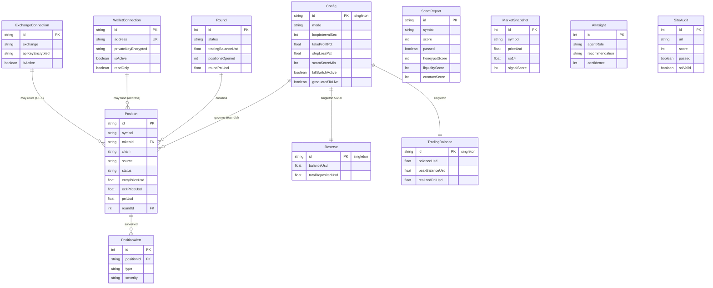

# UML — Auto Trader

> **Versão:** 1.0 — 2026-08-26
> **Ferramenta:** Mermaid (renderiza no GitHub, VS Code, docsify)
> **Fonte da verdade:** `prisma/schema.prisma` + `src/lib/trading/*.ts` + `src/lib/chain/*.ts` + `src/signer/*.ts`

---

## 1. Diagrama de Classes (Domínio Principal)

```mermaid
classDiagram
    class Config {
        +String id="singleton"
        +String mode "paper"|"live"
        +Int loopIntervalSec
        +Float initialCapitalUsd
        +Int maxPositionsPerRound
        +Float reservePct
        +Float reinvestPct
        +Float takeProfitPct
        +Float stopLossPct
        +Int maxHoldMinutes
        +Float maxDailyLossPct
        +Float maxLossPerTradePct
        +Float maxExposurePerTokenPct
        +Float maxDrawdownPct
        +Int scamScoreMin
        +Float minLiquidityUsd
        +Boolean scanCex
        +Boolean scanDex
        +Boolean engineRunning
        +Boolean killSwitchActive
        +Boolean graduatedToLive
        +getConfig() EngineConfig
        +setEngineRunning(bool)
        +triggerKillSwitch(reason)
    }

    class Position {
        +String id
        +String symbol
        +String tokenId?
        +String chain?
        +String source "cex"|"dex"
        +String status "open"|"closed"|"killed"
        +Float entryPriceUsd
        +Float entryAmountUsd
        +Float entryQty
        +Float takeProfitPrice
        +Float stopLossPrice
        +DateTime maxExitAt
        +Int scamScore
        +Int roundId
        +Float pnlUsd?
        +Float pnlPct?
        +close(reason, price)
    }

    class Reserve {
        +String id="singleton"
        +Float balanceUsd
        +Float totalDepositedUsd
        +Float totalWithdrawnUsd
        +deposit(amount)
        +withdraw(amount)
    }

    class TradingBalance {
        +String id="singleton"
        +Float balanceUsd
        +Float peakBalanceUsd
        +Float realizedPnlUsd
        +Int tradesOpened
        +Int tradesClosed
        +Int wins
        +Int losses
        +applyPnl(pnl)
        +updatePeak()
    }

    class RiskEvent {
        +String id
        +String type "kill_switch"|"daily_loss_breach"|...
        +String severity "info"|"warning"|"critical"
        +String message
        +DateTime triggeredAt
    }

    class ScamReport {
        +String id
        +String symbol
        +Int score 0..100
        +Boolean passed
        +Int honeypotScore
        +Int liquidityScore
        +Int contractScore
        +Int taxScore
        +Int holderScore
        +Int ageScore
        +String findings JSON
    }

    class Round {
        +Int id
        +Float tradingBalanceUsd
        +Float reserveBalanceUsd
        +Int tokensScanned
        +Int tokensPassedFilter
        +Int positionsOpened
        +Int positionsClosed
        +Float roundPnlUsd?
        +String status "running"|"completed"|"aborted"
    }

    class MarketSnapshot {
        +Int id
        +String symbol
        +Float priceUsd
        +Float rsi14?
        +Float macdHist?
        +Float ema20?
        +Float ema50?
        +Int signalScore 0..100
        +String signalLabel
        +Int fearGreedIndex?
    }

    class AIInsight {
        +Int id
        +String agentRole "thesis"|"contract_analyst"|"news_sentiment"|"risk_advisor"
        +String recommendation "buy"|"hold"|"avoid"|"exit"
        +Int confidence 0..100
        +String modelOutput
    }

    class SiteAudit {
        +Int id
        +String url
        +Int score 0..100
        +Boolean passed
        +Boolean sslValid
        +Boolean hstsPresent
        +Boolean safeBrowsingFlagged
        +String redFlags JSON
    }

    class PositionAlert {
        +Int id
        +String positionId
        +String type "goplus_critical_flag"|"liquidity_drain"|...
        +String severity
        +String message
        +DateTime detectedAt
        +DateTime resolvedAt?
    }

    class BacktestResult {
        +Int id
        +String symbols JSON
        +String interval
        +Int totalTrades
        +Float winRate
        +Float profitFactor
        +Float totalPnlUsd
        +Float sharpeRatio
        +String equityCurve JSON
        +String status
    }

    class WalletConnection {
        +String id
        +String label
        +String address
        +String chain?
        +String privateKeyEncrypted? AES-GCM blob
        +Boolean isActive
        +Boolean readOnly
    }

    class ExchangeConnection {
        +String id
        +String label
        +String exchange "binance"|...
        +String apiKeyEncrypted?
        +String apiSecretEncrypted?
        +Boolean isActive
        +Boolean testnet
    }

    Config "1" --> "0..*" Position : governs
    Config "1" --> "1" Reserve : splits 50/50
    Config "1" --> "1" TradingBalance : manages
    Round "1" --> "0..*" Position : contains
    Position "1" --> "0..*" PositionAlert : surveilled by
    Position "1" --> "0..*" MarketSnapshot : analyzed via
    ScamReport .. Position : gates entry
    AIInsight .. Position : advises
    SiteAudit .. Position : platform gates
```



---

## 2. Diagrama de Classes — Camada de Segurança (H0/H1/H2)

```mermaid
classDiagram
    class WalletVault {
        -Map~string,EncryptedBlob~ blobs
        -Buffer masterKey?
        +encryptSecret(plain, pass) EncryptedBlob
        +decryptSecret(blob, pass) string|null
        +rotatePassphrase(blobs, oldPass, newPass) Map
        +zeroizeKeyBuffer(buf)
    }

    class EncryptedBlob {
        +String iv
        +String ciphertext
        +String tag
        +String kdfAlgo "pbkdf2-sha256"
        +Int kdfVersion
        +String encAlgo "aes-256-gcm"
        +Int encVersion
    }

    class AuditLog {
        +String hash SHA256(canonical JSON)
        +String prevHash
        +Int seq monotonic
        +String event
        +DateTime timestamp
        +append(event) void
        +verify(path) boolean
    }

    class QuorumRpcClient {
        +Transport[] endpoints
        +Float quorumFraction 0.5
        +Float healthFloor 0.2
        +readWithQuorum(method, params) result
        +readWithFailover(method, params) result
        +broadcastRawTransaction(raw) hash
        -healthScore Float 0..1
        -circuitBreaker "closed"|"open"|"half-open"
    }

    class SimulationGate {
        +ExpectedDiff expected
        +Simulator simulator
        +verify(tx) {ok, blockReason}
        +compareAmounts(expected, simulated, bps) bool
    }

    class ApprovalGate {
        +Float maxApprovalPerSpender
        +Boolean allowFullBalanceApproval
        +Ledger ledger
        +requestApproval(owner, spender, amount, balance) {ok, cappedAmount, rejectReason}
        +MAX_UINT256 String
    }

    class ContractVerifier {
        +String expectedBytecodeHash
        +String[] expectedSelectors
        +String[] allowedOwners
        +verify(address, chainReader) {ok, reasons[]}
        +detectProxy(code, storage) bool
    }

    class SellSimVerifier {
        +Simulator simulator
        +verify(token, amount, expectedTaxBps) {ok, reasons[]}
        +buySucceeds bool
        +sellSucceeds bool
        +taxMatches bool
    }

    class Pipeline {
        +PipelineConfig cfg
        +process(request) PipelineResult
        -auditExactlyOnce() void
        -fail(reason) PipelineResult
        -succeed(payload) PipelineResult
        +SignerSink signer
    }

    class SignerAdapter {
        +String expectedProtocolVersion
        +SignerWireRequest map(SignerRequest)
        +submit(request) {ok, error}
        -healthCheck() bool
    }

    class Broadcaster {
        +QuorumRpcClient rpc
        +SignerAdapter signer
        +resolveTransactionContext(tx) {nonce, gas}
        +signTransaction(tx) rawSignedTx
        +broadcastSignedTransaction(raw) hash
        +REG14_immutabilityCheck(expectedHash, returnedHash)
    }

    WalletVault --> EncryptedBlob : stores
    EncryptedBlob --> AuditLog : logged via
    SimulationGate --> QuorumRpcClient : uses
    Pipeline --> QuorumRpcClient : gate 1 RPC
    Pipeline --> SimulationGate : gate 2
    Pipeline --> ContractVerifier : gate 3
    Pipeline --> SellSimVerifier : gate 6
    Pipeline --> ApprovalGate : gate 7
    Pipeline --> SignerAdapter : final sink
    SignerAdapter --> Broadcaster : consumed by
```

---

## 3. Diagrama de Sequência — Loop da Engine (SCOUT → REBALANCE)

```mermaid
sequenceDiagram
    participant Scheduler as setInterval(60s)
    participant Engine as Engine.ts
    participant Selector as token-selector / rising-tokens
    participant Platform as platform-scanner
    participant Scam as scam-detector + goplus + site-integrity
    participant Market as market-analysis + ai-agent
    participant Risk as risk-manager
    participant Portfolio as portfolio.ts
    participant Surveillance as position-surveillance
    participant ExitPlanner as exit-planner
    participant DB as Prisma (SQLite)
    participant Bus as event-bus (SSE)

    Scheduler->>Engine: tick() — busy guard
    Engine->>DB: getConfig() + canScoutNow(schedule)
    alt outside trading window
        Engine->>Engine: skip SCOUT, still MONITOR/EXIT
    end

    rect rgb(20, 40, 60)
        note over Engine,Selector: SCOUT
        Engine->>Selector: selectCandidates() — Binance + DexScreener
        Selector->>Platform: getApprovedPlatformIds()
        Platform-->>Selector: Set<platformId> (approved only)
        Selector-->>Engine: TokenCandidate[] (platformId tagged)
        Engine->>Selector: getRisingCandidates() — CoinGecko trending
        Selector-->>Engine: merge CEX+DEX+rising
        Engine->>DB: Round.create(running)
        Engine->>Bus: emit round_started
    end

    rect rgb(30, 50, 30)
        note over Engine,Market: ANALYZE (per candidate)
        loop for each candidate
            Engine->>Scam: analyzeToken(candidate)
            Scam->>Scam: 6 sub-scorers (honeypot 30%, liq 20%, contract 20%, tax 10%, holder 10%, age 10%)
            Scam->>DB: GoPlus scanTokenWithGoPlus()
            Scam->>DB: SiteAudit auditSite(url) — 5 layers (SSL/RDAP/headers/SafeBrowsing/content)
            Scam-->>Engine: {score, passed, breakdown}
            alt score < scamScoreMin (70)
                Engine->>DB: ScamReport.create(passed=false)
                Engine->>Engine: reject candidate
            else passed
                Engine->>Market: analyzeMarket(symbol) — RSI/MACD/EMA/Bollinger + FearGreed
                Market-->>Engine: MarketSnapshot {signalScore, signalLabel}
                Engine->>Market: runAgentSquad(candidate) — 4 roles (thesis/contract/news/risk)
                Market-->>Engine: AIInsight[] {recommendation, confidence}
                Engine->>DB: MarketSnapshot.create + AIInsight.create
            end
        end
        Engine->>Platform: platform gate — reject if token.platformId not in approved Set
    end

    rect rgb(50, 30, 30)
        note over Engine,Portfolio: EXECUTE
        loop for each approved candidate (up to maxPositionsPerRound)
            Engine->>Risk: assessTradeRisk(candidate, amount)
            Risk->>DB: TradingBalance + RiskEvent checks (killSwitch/dailyLoss/perTrade/exposure/drawdown)
            alt breaker triggered
                Risk-->>Engine: {allowed=false, reason}
                Engine->>DB: RiskEvent.create + AppLog
                Engine->>Bus: emit risk_blocked
            else allowed
                Engine->>Portfolio: openPosition(candidate, amount, TP/SL/timeout)
                Portfolio->>DB: Position.create + TradingBalance.tradesOpened++
                Portfolio-->>Engine: Position
                Engine->>Bus: emit position_opened
                Engine->>DB: notifyEvent(position_opened)
            end
        end
    end

    rect rgb(40, 40, 20)
        note over Engine,ExitPlanner: MONITOR + SURVEILLANCE
        Engine->>Portfolio: fetchPricesBatch(openPositions)
        Portfolio-->>Engine: Map<symbol, priceUsd>
        loop for each open position
            Engine->>Surveillance: runSurveillance(position, price)
            Surveillance->>Scam: GoPlus re-scan
            Surveillance-->>Engine: PositionAlert[] (goplus_critical/liquidity_drain/price_dump/holder_concentration/tax_spike/price_anomaly/timeout)
            Engine->>ExitPlanner: planExit(position, price, market, ai)
            ExitPlanner-->>Engine: {action: hold|tighten_sl|raise_tp|scale_out|exit_now}
            Engine->>Portfolio: applyExitPlan(action)
            alt TP/SL/timeout/killSwitch hit
                Engine->>Portfolio: closePosition(id, reason, exitPrice)
                Portfolio->>DB: Position.update(closed) + TradingBalance realizedPnl
                Portfolio-->>Engine: closed Position
                Engine->>Surveillance: resolveAlertsForPosition(id, "exited_position")
                Engine->>Bus: emit position_closed
                Engine->>DB: notifyEvent(position_closed)
            end
        end
        Engine->>DB: recordSnapshotIfDue() — PerformanceSnapshot every N ticks
    end

    rect rgb(30, 30, 50)
        note over Engine,DB: REBALANCE (when round has 0 open positions)
        Engine->>Portfolio: rebalanceRound(roundId)
        Portfolio->>DB: sum closed P&L for round
        alt P&L > 0
            Portfolio->>DB: Reserve.balanceUsd += P&L * 50% ; TradingBalance += P&L * 50%
            Portfolio->>DB: Round.update(completed, roundPnlUsd)
        else P&L <= 0
            Portfolio->>DB: TradingBalance.realizedPnl += P&L (no reserve)
        end
        Portfolio-->>Engine: Round completed
        Engine->>Bus: emit round_completed
        Engine->>DB: graduation check — paperCyclesPassed++ if profitable
    end

    Engine->>DB: AppLog.create(level, source, message)
```

---

## 4. Diagrama de Sequência — Pipeline Hardened (H1+H2 → Signer → Broadcast)

```mermaid
sequenceDiagram
    participant Caller as Engine / Operator
    participant Pipe as Pipeline (pipeline.ts)
    participant RPC as QuorumRpcClient (H1.1)
    participant Sim as SimulationGate (H1.2)
    participant CV as ContractVerifier (H2.1)
    participant LV as LiquidityVerifier (H2.2)
    participant AV as TokenAuthorityVerifier (H2.3)
    participant SS as SellSimVerifier (H2.4)
    participant AG as ApprovalGate (H1.3)
    participant MEV as mev-baseline (H1.4)
    participant Adapter as SignerAdapter (M3.1)
    participant Signer as signer process (Unix socket)
    participant BC as Broadcaster (M3.3)
    participant Chain as EVM RPC (quorum)

    Caller->>Pipe: process(PipelineRequest)

    rect rgb(25, 35, 45)
        note over Pipe,RPC: GATE 1 — RPC Resilience
        Pipe->>RPC: readWithQuorum(chainId, blockNumber, balance)
        RPC->>RPC: fan-out to N endpoints, healthScore check, quorum 0.5
        alt quorum disagreement or < healthFloor
            RPC-->>Pipe: {ok:false, reason:"quorum disagreement"}
            Pipe->>Pipe: fail(reason) — audit exactly once
            Pipe-->>Caller: {ok:false, failedGate:"rpc"}
        end
        RPC-->>Pipe: {ok:true}
    end

    rect rgb(35, 25, 35)
        note over Pipe,SS: GATES 2-6 — Contract interaction hardening
        Pipe->>Sim: verify(tx, expectedDiff)
        alt revert or diff divergence or gas > maxGas
            Sim-->>Pipe: {ok:false, blockReason}
            Pipe->>Pipe: fail(blockReason)
            Pipe-->>Caller: {ok:false, failedGate:"simulation"}
        end
        Pipe->>CV: verify(address, manifest)
        alt bytecode/selector/owner/proxy/upgradeability mismatch
            CV-->>Pipe: {ok:false, reasons}
            Pipe-->>Caller: {ok:false, failedGate:"contract"}
        end
        Pipe->>LV: verify(pool, manifest)
        Pipe->>AV: verify(token, manifest)
        Pipe->>SS: verify(token, amount, expectedTaxBps)
        alt any gate fails
            Pipe->>Pipe: fail(reasons.join("; "))
            Pipe-->>Caller: {ok:false, failedGate:"liquidity|authority|sellSim"}
        end
    end

    rect rgb(30, 40, 30)
        note over Pipe,MEV: GATES 7-8 — Approval + MEV
        Pipe->>AG: requestApproval(owner, spender, amount, balance)
        alt unlimited (=MAX_UINT256) or capped >= balance or > cap
            AG-->>Pipe: {ok:false, rejectReason}
            Pipe-->>Caller: {ok:false, failedGate:"approval"}
        end
        Pipe->>MEV: checkSlippage(expected, actual, inputs) + detectSandwich(...)
        alt slippage > dynamicLimit or sandwich score >=0.5
            MEV-->>Pipe: {ok:false, reason}
            Pipe-->>Caller: {ok:false, failedGate:"mev"}
        end
    end

    rect rgb(20, 30, 50)
        note over Pipe,Chain: SIGN + BROADCAST (M3)
        Pipe->>Adapter: submit(SignerRequest) — payload + payloadHash + protocolVersion
        Adapter->>Adapter: health_check pre-flight (protocol version match)
        alt version mismatch
            Adapter-->>Pipe: {ok:false, error:"SIGNER_PROTOCOL_MISMATCH"}
            Pipe-->>Caller: {ok:false, failedGate:"signer"}
        end
        Adapter->>Signer: JSON-RPC 2.0 over Unix socket (timeout)
        Signer->>Signer: validateProtocolVersion() + vault unlocked? + readOnly? + key-addr verify
        Signer-->>Adapter: {ok:true, rawSignedTx} or {ok:false, error}
        Adapter-->>Pipe: signerResult
        alt signer failed
            Pipe-->>Caller: {ok:false, failedGate:"signer"}
        end
        Pipe->>BC: broadcastSignedTransaction(rawSignedTx)
        BC->>BC: expectedHash = keccak256(rawSignedTx) — REG-014 immutability
        BC->>Chain: eth_sendRawTransaction(rawSignedTx) via QuorumRpcClient
        Chain-->>BC: returnedHash
        BC->>BC: assert expectedHash == returnedHash (REG-014)
        alt hash mismatch — chain tampered
            BC-->>Pipe: {ok:false, error:"hash mismatch"}
        end
        BC-->>Pipe: {ok:true, hash}
        Pipe->>Pipe: succeed(hash) — audit exactly once
        Pipe-->>Caller: {ok:true, txHash}
    end

    note over Pipe: Invariants: order fixed, short-circuit on first fail, original reason preserved verbatim, audit exactly once, no bypass flag exists
```

---

## 5. Diagrama de Entidade-Relacionamento (ER) — prisma/schema.prisma



---

## 6. Notas de Implementação

- **Monolito modular:** não há services separados; modules em `src/lib/trading/*` e `src/lib/chain/*` são os bounded contexts. Ver `docs/ARCHITECTURE.md`.
- **SQLite vs PostgreSQL:** `schema.prisma` provider=sqlite (dev), migration baseline captura estado; prod usa `DATABASE_URL` com PostgreSQL sem mudar schema (Prisma abstrai). RLS em Postgres via policies; em SQLite via app-layer guard (ver `docs/RLS.md`).
- **Audit hash-chain:** `AuditLog` (src/lib/audit/audit-log.ts) não é Prisma model — é file-based append-only com `prevHash` + `seq` monotonic (ver `docs/CRYPTO.md`).
- **Signer isolation:** `WalletVault` vive SÓ no signer process; web process nunca vê plaintext key. `SignerAdapter` é o único caminho web→signer.
